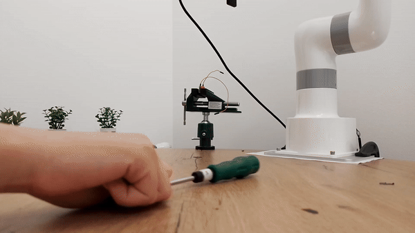

# RoboImitate - Imitation learning project 

|   |  |
|:-------------------------------------------------------------------:|:----------------------------------------------------:|
| Object picking with imitation learning                         | Object picking when pose of object is randomized    |

<div align='center'>
	
</div>

</br>

<div>

The **RoboImitate** project supports imitation learning through a [**Diffusion Policy**](https://diffusion-policy.cs.columbia.edu/). This policy learns behavior using expert demonstrations. *(Stay tuned for our upcoming YouTube presentation for more details!)*


#### This repository allows you to:

- **Collect demonstrations** in both real and simulated environments. [Learn more here](xarm_bringup/scripts/README.md).
- **Train and evaluate** a Diffusion Policy model. [Learn more here](imitation/README.md).
- **Support** the Lite 6 robot arm. [Learn more here](xarm_bringup/README.md).

</div>


>[!IMPORTANT]  
You need to have Docker installed. If you have an Nvidia GPU, you need to additionally follow this [guide](https://docs.nvidia.com/datacenter/cloud-native/container-toolkit/latest/install-guide.html). Additionally, you need to istall Isaac-Sim If you want to use simulation. 

### Installation
- Download our source code:
```sh
git clone https://github.com/MarijaGolubovic/robo_imitate.git && cd robo_imitate/docker
```

- Build docker container
```sh
make build-pc run exec
```
- Build ROS 2 packages
```sh
colcon build --symlink-install && source ./install/local_setup.bash
```

### Model evaluation
>[!NOTE] 
You can download pretrain model and aditional files from this link. Downloaded model and files you need to put inside folder `imitation/outputs/train`. If folder don't exist you need to create it.


Inside docker container run:
- Run ROS 2 controler
```sh
ros2 launch xarm_bringup lite6_cartesian_launch.py rviz:=false sim:=true
```
If you want to vizualize robot set `rviz` on true. If you want to use real enviroment set `sim` on false.

- Open another terminal and run docker
```sh
make exec
```

- Run model inside docker
```sh
./src/robo_imitate/imitation/pick_screwdriver
```

### Model training
Inside `robo_imitate` directory run follow commands:

```sh 
docker build --build-arg UID=$(id -u) -t imitation .
```

```sh
docker run -v $(pwd)/imitation/:/docker/app/imitation:Z --gpus all -it -e DATA_PATH=imitation/data/real_env_data.parquet -e EPOCH=10 imitation
```

>[!TIP]
 If you want to run model training inside docker, run this command inside the folder `src/robo_imitate`. Before that, you need to build the docker (see the [Installation](#installation) section for details).

```sh
python3 ./imitation/compute_stats --path imitation/data/real_env_data.parquet  && python3 ./imitation/train_script --path imitation/data/real_env_data.parquet  --epoch 1000
```

### Acknowledgment
- Thanks to LeRobot team for open sourcing LeRobot projects. 
- Thanks to Cheng Chi, Zhenjia Xu and colleagues for open sourcing Diffusion policy